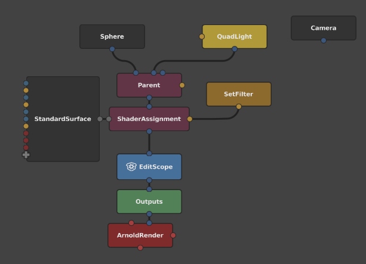
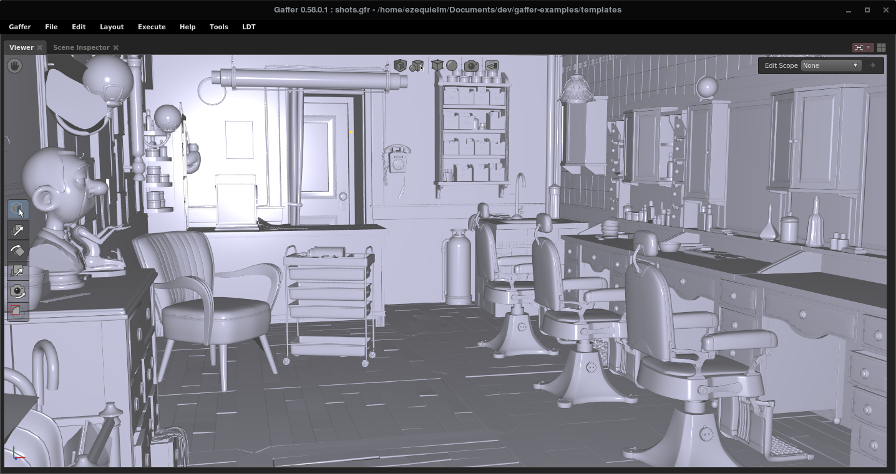
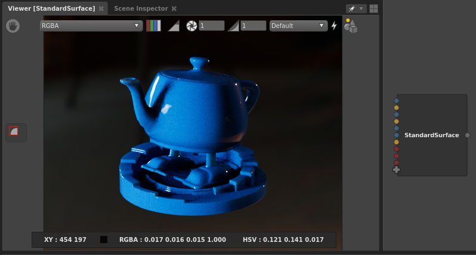
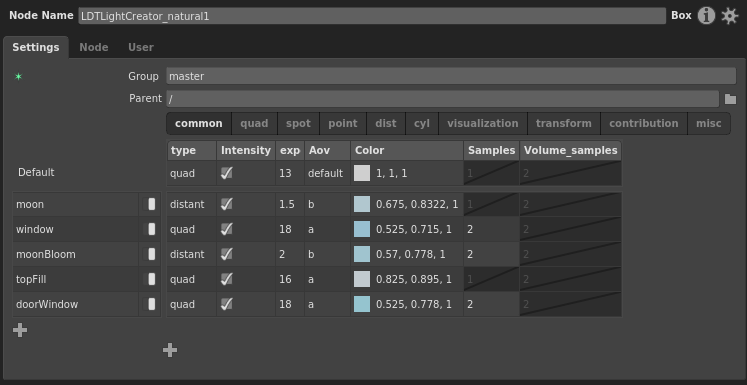
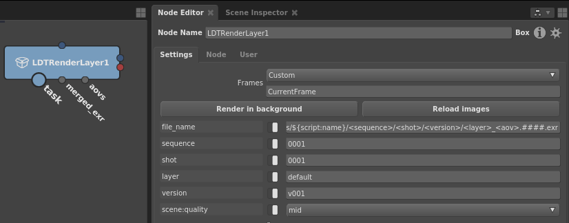
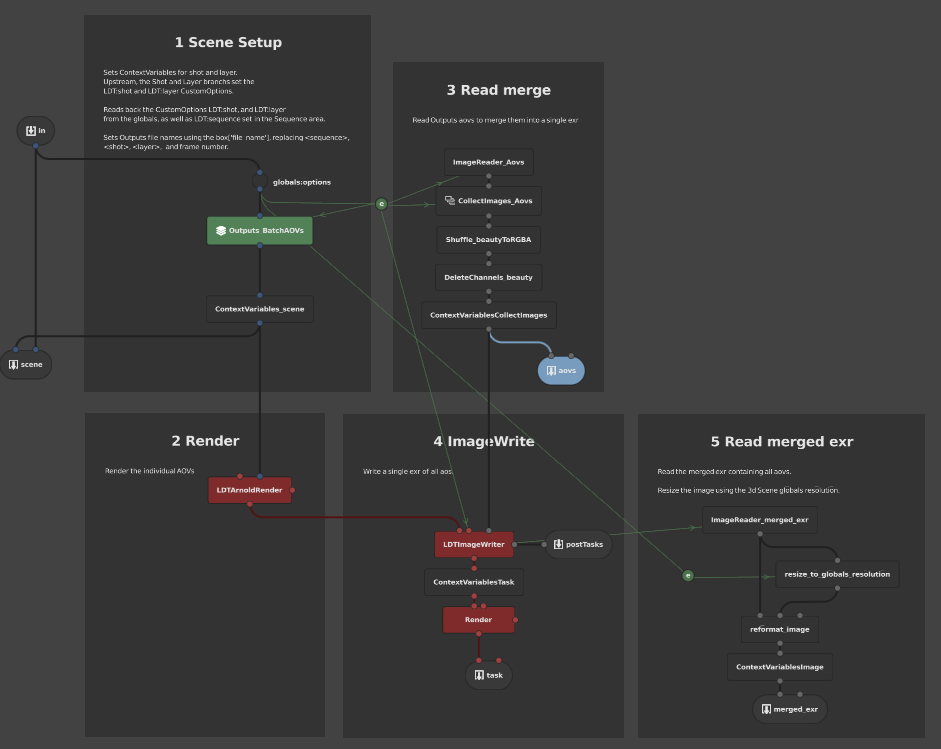
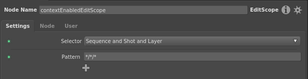
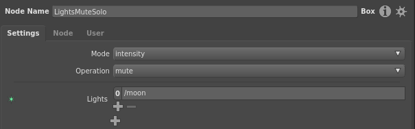
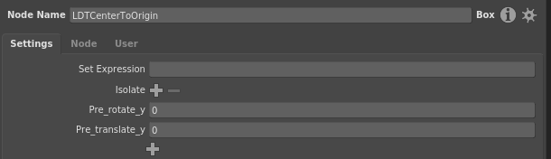
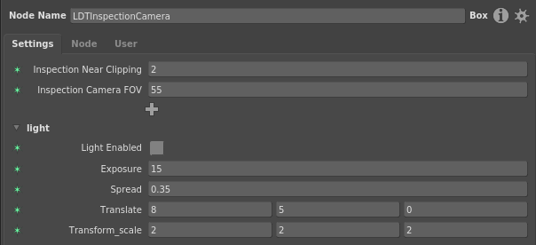

# LDTGaffer
My gaffer toolset, presets, and configs.

## UI

### Miscelaneous
* Custom Variables LDT resources
* Bookmarks LDT folders
* LDT Menu: Export Extension, Node Annotations
* Gaffer Cache MemoryLimit
* Arnold Outputs: Custom lightgroup_[a-g], and lightgroup_denoise[a-g] using optix filter.

### NameSwitch and Spreadsheet Presets
```
${sequence}/${shot}/${layer}
${sequence}/${shot}
${sequence}
${shot}/${layer}
${shot}
${layer}
```

### nodeGadget:color
Same as Gaffer Defaults (except lights, and filters), but easier on the eye.


## Python

### LDT Menu
##### Export Extension
Default Gaffer export extension example. Might not work with Spreadsheets, etc.

##### Annotation
Set selected nodes Metadata `annotation:greeting:text`

### SceneView:Phong and graph editor OpenGL phong Shader
Tired of the facing ratio look?
You can thank [Irene Hernández](https://www.linkedin.com/in/ireneher/) for this.



### ShaderView:Shader Ball
Based on an editable Box inside the resources folder.


### ShaderView:Shader Teapot


### Viewport Diagnostic Patterns


## Boxes 3d

#### LightCreator


#### Attribute Sets


### LDTRenderLayer



### contextEnabled Editscope and Box
Contents will only be enabled when in the given context. Both Editscope and Box based.
The EditScope based contains Edit TweaksNodes ready to use.



### LightsMuteSolo
Mutes/Solo lights, using intensity or prune.



### Center To Origin
Centers the given objects to the origin.



### UvSizeMultipler
Scales the objects UVs. Useful for the ShaderBall scene, where you want to scale the uvs
for visualization instead of modifying the material tiling.

### Inspection Camera
Inspection camera drop in.



## Boxes 2d
### ShowMetadata
Search metadata keys with partial matching, and overlays on the image. For ie: /stats/geo will display all /arnold/stats/geo..., samples will display all keys that contain the word samples. Leave a blank field, and it will display all available keywords   

