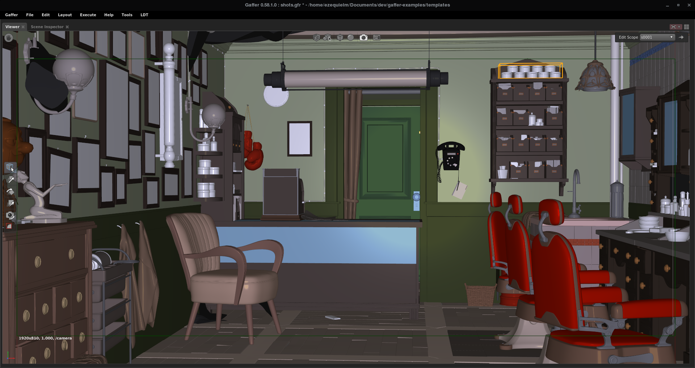
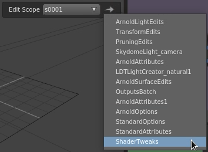
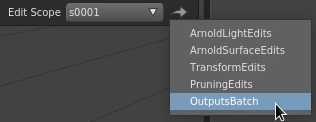

# LDTGaffer
My gaffer toolset, presets, and configs.

```Requires Gaffer 0.58.1.0```

### Folders and Variables
* Custom Variables LDT resources
* Bookmarks LDT folders

### LDT Menu
* Export Extension
* Node Annotations
* register includeInNavigationMenu 

### Node Defaults nodeGadget:color
Same as Gaffer Defaults, but paler colours easier on the eye.
Except lights (yellow color), and filters (similar color to the Filter plugs colors).   


### Viewer:
##### SceneView:Phong, graph Editor Phong, and Diagnostics 2k/4k textures



Phong courtesy of [Irene Hernández](https://www.linkedin.com/in/ireneher/).  
Cs and transparency plugs.

### ShaderView:Shader Balls and 


### Arnold Outputs
* Lightgroup_[a-g]
* Lightgroups_denoise[a-g] with optix filter.

### NameSwitch and Spreadsheet Presets
```
${sequence}/${shot}/${layer}
${sequence}/${shot}
${sequence}
${shot}/${layer}
${shot}
${layer}
```

### Node Defaults EditScopes
* IncludeInNavigationMenu:
  * GafferArnold.ArnoldLight
  * GafferScene.ShaderTweaks
  * GafferScene.StandardOptions
  * GafferArnold.ArnoldOptions
  * GafferScene.StandardAttributes
  * GafferArnold.ArnoldAttributes
  * And some LDTNodes



### Scene Inspector registerShaderParameter
* aiStandardVolume: density, scatter_anisotropy, transparent_depth 
* aiLights: all contributions


### Boxes 3d

##### LightCreator


##### Attribute Sets
Give it an attribute name and a scene:path, and will create a Set per unique attribute value containing the geometry.   


##### LDTRenderLayer


##### contextEnabled Editscope and Box
Contents will only be enabled when in the given context. Both Editscope and Box based.
The EditScope based contains Edit TweaksNodes ready to use.


##### LightsMuteSolo
Mutes/Solo lights, using intensity or prune.


##### Center To Origin
Centers the given objects to the origin.


##### UvSizeMultipler
Scales the objects UVs. Useful for the ShaderBall scene, where you want to scale the uvs
for visualization instead of modifying the material tiling.

##### Inspection Camera
Inspection camera drop in.


### Boxes 2d
##### ShowMetadata
Search metadata keys with partial matching, and overlays on the image. For ie: /stats/geo will display all /arnold/stats/geo..., samples will display all keys that contain the word samples. Leave a blank field, and it will display all available keywords   


### Misc
* Gaffer Cache MemoryLimit